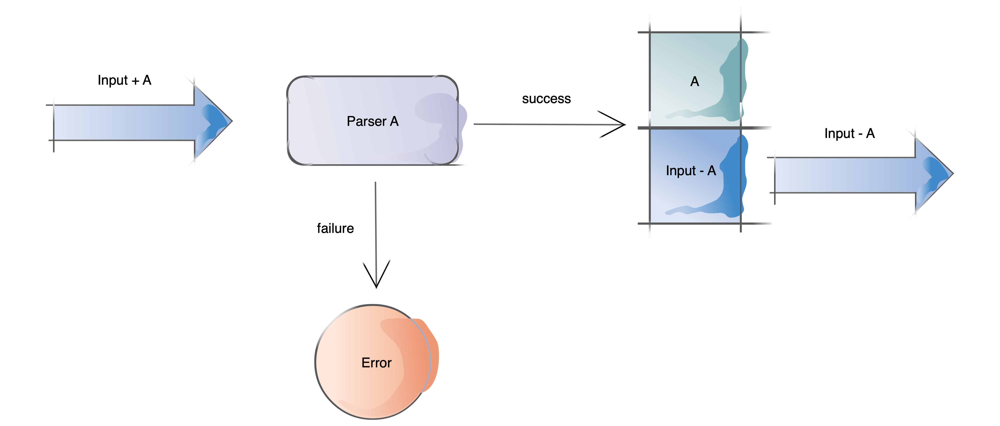

# Build you a Parser Combinator for Great Good

# Introduction

## What is a parser

> a parser is just a function that consumes less-structured input and produces more-structured output.
- Alexis King from [Parse Don't Validate](https://lexi-lambda.github.io/blog/2019/11/05/parse-don-t-validate/)


> For our purposed we can think of a parser that takes in some text input and converts into something more specific like another type.


## What is a parser combinator





- Is partial function from some input to some output
- Is an open grammar
- Has a way of signalling failure
- Simple pieces combined to create more advanced grammars
- We parse each term of our grammar by recursively calling the parsers for each sub-term (Recursive Decent)
- Functions that combine and transform parsers into other parsers


These features will become clear when we work through the exercise


# Haskell Syntax

## Functions

```haskel
someFunction :: String -> Int -> Bool -- function definition
```

```haskel
someFunction str n = True -- function implementation
```


```haskel
function name
     |
someFunction ::    String -> Int -> Bool
             |        |       |       |
             |     param1  param2  result
      start of function defition
```


```haskel
function name
     |
someFunction str   n   = True -- function implementation
              |    |       |
          param1 param2 result
```


## Pattern matching


```haskell
case either of
  Left error  -> undefined
  Right value -> undefined
```

```haskell
case option of
  Nothing    -> undefined
  Just value -> undefined
```


```haskell
someFunction :: String -> Int -> Bool
someFunction "Hello" 1 = undefined
someFunction "Hello" 2 = undefined
someFunction str     n = undefined
```

